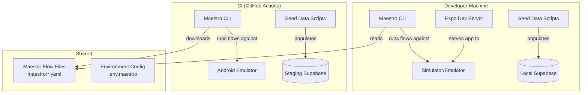

# Design Document: Mobile E2E Testing with Maestro

## Overview

This design defines the architecture, component structure, and implementation strategy for adding Maestro-based end-to-end testing to the NurseLink mobile app. The design covers test infrastructure, flow organization, test ID strategy, CI integration, and data management. Tests are written as Maestro YAML flows that simulate real user interactions across all three roles (family, nurse, admin), on both iOS and Android, targeting either a local dev environment or staging.

### Key Technologies

- **Framework**: Maestro CLI (pinned version)
- **App Platform**: Expo 54 / React Native 0.81.5 (iOS + Android)
- **Backend**: Supabase (shared staging + local dev instances)
- **CI**: GitHub Actions (existing project CI)
- **Local Testing**: iOS Simulator + Android Emulator via Expo dev server
- **Staging Testing**: Maestro as a Service (MaaS) or local CLI pointing to staging

### Design Principles

1. **Deterministic by default** — Every test flow creates its own unique test data and cleans up after itself, avoiding flaky shared-state dependencies
2. **Test ID first** — All element selection uses `testID` props (not text, XPath, or coordinate-based), ensuring reliable cross-platform element targeting
3. **Environment-agnostic** — Flows are parameterized via Maestro environment variables (`ENV`, `BASE_URL`, `SUPABASE_URL`), so the same flows work in local dev and staging
4. **Minimal external dependencies** — The test harness requires only Maestro CLI, a running app instance, and seed data scripts — no additional servers or services

## Architecture

### High-Level Architecture



### Flow Organization

```
apps/mobile/
├── maestro/
│   ├── config.yaml                    # Maestro project config
│   ├── .env.maestro                   # Environment variable defaults
│   ├── shared/
│   │   ├── setup.yaml                 # Seed data and app launch
│   │   ├── teardown.yaml              # Cleanup resources
│   │   └── helpers.yaml               # Reusable subflows (loginAs, etc.)
│   ├── auth/
│   │   ├── register-family.yaml       # Family registration flow
│   │   ├── register-nurse.yaml         # Nurse registration flow
│   │   ├── login-success.yaml          # Successful login
│   │   ├── login-failure.yaml          # Invalid credentials
│   │   ├── forgot-password.yaml        # Password reset flow
│   │   └── session-restore.yaml        # Session persistence
│   ├── family/
│   │   ├── browse-nurses.yaml          # Browse and filter nurses
│   │   ├── nurse-detail.yaml           # View nurse public profile
│   │   ├── request-booking.yaml        # Create new booking
│   │   ├── bookings-list.yaml          # View family bookings
│   │   └── booking-detail.yaml         # View booking + leave review
│   ├── nurse/
│   │   ├── set-availability.yaml       # Toggle availability grid
│   │   ├── accept-booking.yaml         # Accept a booking request
│   │   ├── decline-booking.yaml        # Decline a booking request
│   │   ├── bookings-list.yaml          # View nurse bookings
│   │   └── messages.yaml               # View messages inbox
│   ├── admin/
│   │   ├── dashboard-metrics.yaml      # Verify admin dashboard
│   │   ├── verification-queue.yaml     # Browse/filter queue
│   │   ├── verification-detail.yaml    # View applicant details
│   │   ├── approve-verification.yaml   # Approve a nurse
│   │   └── reject-verification.yaml    # Reject a nurse
│   └── full-regression.yaml            # Sequential all-flows suite
├── scripts/
│   ├── seed-e2e.mjs                    # Seed test data script
│   ├── cleanup-e2e.mjs                 # Cleanup test data script
│   └── run-maestro.sh                  # Convenience runner script
```

### Test ID Annotation Strategy

Every interactive element that Maestro needs to interact with must have a `testID` prop. The naming convention follows `{screen}_{action}` pattern:

| Pattern | Example | Usage |
|---------|---------|-------|
| `{screen}_input_{field}` | `login_input_email` | Text input fields |
| `{screen}_button_{action}` | `login_button_submit` | Buttons |
| `{screen}_link_{target}` | `login_link_forgotPassword` | Text links |
| `{screen}_list_{name}` | `browse_list_nurses` | FlatList/SectionList |
| `{screen}_card_{id}` | `booking_card_${id}` | List item cards |
| `{screen}_tab_{name}` | `tab_nurse_home` | Tab bar items |
| `{screen}_toggle_{name}` | `availability_toggle_mon_morning` | Toggle switches |
| `{screen}_badge_{type}` | `booking_badge_status` | Status badges |
| `{screen}_header_{title}` | `dashboard_header_welcome` | Header/Title text |

### Environment Configuration

```yaml
# maestro/.env.maestro
# Runtime environment - set to "local" or "staging"
ENV: "local"

# Local development
APP_ID_LOCAL: "host.exp.Exponent"
APP_ID_STAGING: "com.hanapkalinga.nurselink"

# Supabase
SUPABASE_URL_LOCAL: "http://localhost:54321"
SUPABASE_URL_STAGING: "https://your-project.supabase.co"

# Test accounts (seed data credentials)
TEST_EMAIL_PREFIX: "e2e-test"
TEST_PASSWORD: "TestPass123!"
```

### Maestro Config

```yaml
# maestro/config.yaml
flows:
  paths:
    - auth/
    - family/
    - nurse/
    - admin/
  env:
    ENV: "local"
    APP_ID: "host.exp.Exponent"
```

## Correctness Properties

### Property 1: Flow Determinism
*For any* Maestro flow run, given the same seed data and app version, the test SHALL produce the same pass/fail result regardless of execution order, platform, or environment.

**Validates: Requirements 1, 8**

### Property 2: Registration Completeness
*For any* unique email submitted through the registration flow, the system SHALL create a valid profile with the correct role, persist the credential, and redirect to the correct role dashboard.

**Validates: Requirements 2.3, 2.4, 2.5**

### Property 3: Auth Isolation
*For any* user session, the authenticated role SHALL only have access to screens and actions permitted for that role. A family user SHALL NOT access nurse or admin screens, and vice versa.

**Validates: Requirements 3.1, 3.5**

### Property 4: Booking State Machine
*For any* booking created through the family flow, the booking status SHALL follow the state machine: `pending` → (nurse accepts) → `confirmed` OR (nurse declines) → `declined`. No other transitions SHALL be valid.

**Validates: Requirements 4.4, 5.4, 5.5**

### Property 5: Admin Action Auditability
*For any* verification action (approve, reject, resubmission), the system SHALL create an audit log entry recording the admin user, action, and timestamp.

**Validates: Requirements 6.5, 6.6**

### Property 6: Platform Parity
*For every* Maestro flow, the exact same flow file SHALL pass on both iOS Simulator and Android Emulator without modification.

**Validates: Requirements 1.6, 2.6**

### Property 7: CI Reliability
*For any* CI run of the Maestro test suite, if the app is healthy and seed data exists, the test suite SHALL complete within 30 minutes and produce a pass/fail result with screenshots for any failing flows.

**Validates: Requirements 7.1, 7.2, 7.3**

## Test Data Management

### Seed Data Strategy

A Node.js script (`scripts/seed-e2e.mjs`) populates the database with:

1. **Test accounts** — One account per role with known credentials:
   - `e2e-test-family-{timestamp}@example.com` (family)
   - `e2e-test-nurse-{timestamp}@example.com` (nurse) — verified status
   - `e2e-test-nurse-pending-{timestamp}@example.com` (nurse) — pending verification
   - `e2e-test-admin-{timestamp}@example.com` (admin)
2. **Pre-existing data** — Sample nurses with complete profiles, sample bookings in various states (pending, confirmed, completed, declined)
3. **Documents** — Placeholder document records for verification testing

### Cleanup Strategy

An `afterAll` script or CI post-job step calls `scripts/cleanup-e2e.mjs` which deletes all records where `email LIKE 'e2e-test-%'`.

### Unique Account Generation

Each flow generates unique emails using `e2e-test-{role}-{Date.now()}@example.com` to prevent collisions when running flows in parallel.

## Error Handling

| Scenario | Expected Behavior | Reporting |
|----------|------------------|-----------|
| Flow cannot find element | Maestro retries with timeout, then fails with screenshot | Failure output includes element name and screenshot path |
| App crashes during flow | Maestro reports flow as failed | CI marks job as failed |
| Seed data already exists | Script skips existing, logs warning | Warning in test output |
| Network timeout | Maestro retries up to 3 times | Logged in flow output |
| Test data cleanup fails | Script logs error but exits with 0 (non-blocking) | Warning in test output |

## Testing Strategy

### Unit Tests
- Unchanged — existing Jest tests continue to cover components, hooks, and utilities

### Integration Tests
- Unchanged — existing Jest tests continue to cover context providers and hook interactions

### E2E Tests (Maestro — This Spec)
- 20+ Maestro flow files covering all critical user paths
- Each flow is self-contained with its own test data (unique per-run emails)
- Flows use `testID` selectors exclusively
- Support both iOS and Android from the same flow files

### Property-Based Testing Applicability

**Assessment**: NOT APPLICABLE

**Rationale**: E2E testing with Maestro is inherently sequential and scenario-based — it tests specific user journeys against a running system. Property-based testing (randomized input generation) is better suited for unit/integration tests of pure functions or API endpoints, not for UI-driven E2E flows. The correctness properties defined above are validated through targeted, deterministic flows, not through random input generation.
