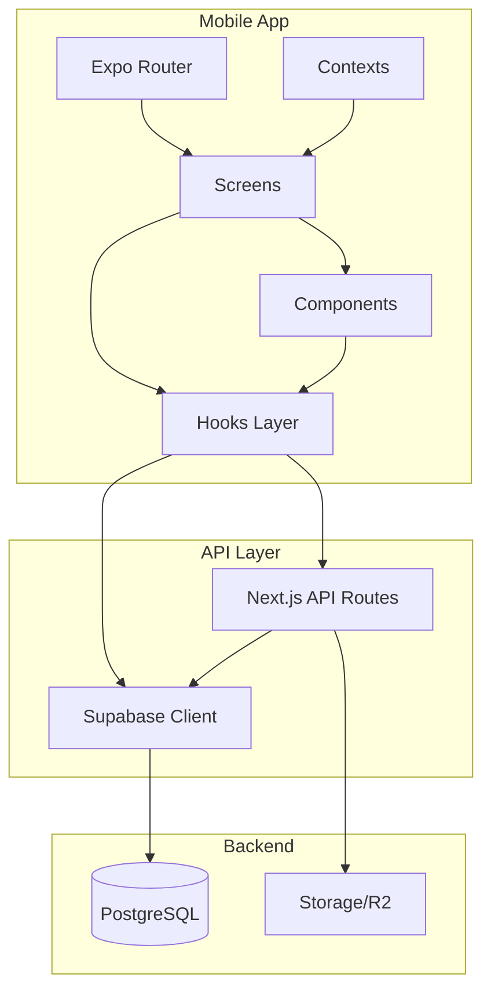
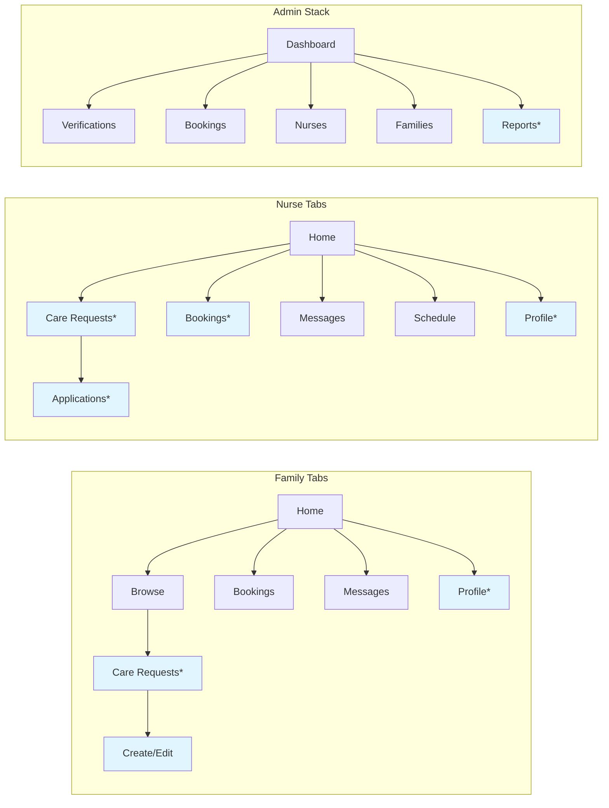

# Design Document: Mobile Feature Parity

## Overview

This design covers six feature groups to achieve mobile/web parity across the NurseLink React Native (Expo) app. The mobile app uses Expo Router for navigation, Supabase as the backend (reusing existing web API routes where possible), and a custom hooks layer for data fetching. New screens, components, and hooks are added for each feature group while following existing patterns in the codebase.

### Key Technologies
- **Mobile**: Expo SDK 54, React Native, Expo Router (file-based routing)
- **State**: React Context (AuthContext, ThemeContext) + custom hooks
- **Backend**: Supabase (direct client calls + existing `/api/*` web endpoints via fetch)
- **Shared**: `@hanapkalinga/shared` (types, constants, validations)

### Design Principles
1. **Reuse existing web APIs** — mobile calls the same Supabase tables and REST endpoints the web uses
2. **Follow established patterns** — new screens mirror existing mobile screen structure (ScreenWrapper, custom hooks, typed styles)
3. **Minimal new hooks** — extend existing hooks or use generic `useSupabaseQuery`/`useSupabaseMutation`
4. **Progressive disclosure** — add navigation entries only when user has the matching role

## Architecture

### High-Level Architecture



### Navigation Structure (Additions)



## Components and Interfaces

### New Screens (Expo Router)

| Route | Screen | Role | Purpose |
|-------|--------|------|---------|
| `(family)/care-requests/index` | CareRequestsScreen | Family | List of own care requests |
| `(family)/care-requests/new` | NewCareRequestScreen | Family | Create care request form |
| `(family)/care-requests/[id]` | CareRequestDetailScreen | Family | View/edit/delete own request |
| `(family)/care-requests/[id]/edit` | EditCareRequestScreen | Family | Edit existing request |
| `(nurse)/care-requests/index` | NurseCareRequestsScreen | Nurse | Browse open care requests |
| `(nurse)/care-requests/[id]` | NurseCareRequestDetailScreen | Nurse | View + apply to request |
| `(nurse)/applications/index` | NurseApplicationsScreen | Nurse | Track submitted applications |
| `(admin)/reports/index` | AdminReportsScreen | Admin | List incident reports |
| `(admin)/reports/[id]` | AdminReportDetailScreen | Admin | Review report details |

### New/Modified Components

```typescript
// Care Request
interface CareRequestCardProps {
  request: CareRequest;
  onPress: () => void;
}

interface CareRequestFormProps {
  initialValues?: Partial<CareRequestFormValues>;
  onSubmit: (values: CareRequestFormValues) => Promise<void>;
}

// Booking Lifecycle
interface CancelBookingModalProps {
  bookingId: string;
  cancelledBy: 'family' | 'nurse';
  visible: boolean;
  onClose: () => void;
  onCancelled: () => void;
}

interface MarkCompleteButtonProps {
  bookingId: string;
  onUpdated: () => void;
}

interface CompletionActionsProps {
  bookingId: string;
  onUpdated: () => void;
}

// Incident Reporting
interface ReportUserMenuProps {
  reportedUserId: string;
  reportedUserName: string;
  bookingId?: string;
}

// Profile
interface ProfilePhotoUploaderProps {
  photoUrl: string | null;
  displayName: string;
  onPhotoChange: (url: string) => void;
}
```

### New Hooks

| Hook | Purpose | Source |
|------|---------|--------|
| `useFamilyCareRequests(userId)` | Fetch family's care requests | Supabase |
| `useNurseCareRequests()` | Browse open care requests | Supabase |
| `useCareRequestDetail(id)` | Single care request + applications | Supabase |
| `useNurseApplications(userId)` | Nurse's submitted applications | Supabase |
| `useAdminReports()` | List incident reports | Supabase |
| `useAdminReportDetail(id)` | Single report detail | Supabase |

### Existing Hooks to Extend

| Hook | Modification |
|------|-------------|
| `useBookingDetail` | Add cancel, mark-complete, confirm-complete, dispute actions |
| `useNurseBookings` | No changes needed (unread_count already present) |
| `useFamilyBookings` | No changes needed |

## Data Models

### TypeScript Types (all exist in `@hanapkalinga/shared/types`)

```typescript
// Already in shared types — just need to ensure mobile imports them
export interface CareRequest {
  id: string;
  family_id: string;
  title: string;
  description?: string;
  care_type: string;
  region: string;
  city: string;
  barangay?: string;
  required_specializations?: string[];
  budget_band?: string;
  start_date?: string;
  status: 'open' | 'filled' | 'cancelled';
  created_at: string;
}

export interface CareRequestApplication {
  id: string;
  care_request_id: string;
  nurse_id: string;
  status: 'pending' | 'withdrawn' | 'accepted' | 'rejected';
  created_at: string;
}

export interface IncidentReport {
  id: string;
  reporter_id: string;
  reported_user_id: string;
  booking_id?: string;
  category: string;
  description: string;
  status: 'open' | 'under_review' | 'resolved' | 'dismissed';
  created_at: string;
}

export interface UserBlock {
  blocker_id: string;
  blocked_id: string;
  created_at: string;
}
```

### Supabase Queries (Existing Tables)

All tables already exist — mobile only queries them:

```sql
-- Care requests (table already exists)
SELECT * FROM care_requests WHERE family_id = $userId ORDER BY created_at DESC;
SELECT * FROM care_requests WHERE status = 'open' ORDER BY created_at DESC;

-- Applications (table already exists)
SELECT * FROM care_request_applications WHERE nurse_id = $userId;

-- Incident reports (table already exists)
SELECT * FROM incident_reports ORDER BY created_at DESC;
```

## Correctness Properties

### Property 1: Care Request Ownership
*For any* care request created by a family user, ONLY that family and admin users SHALL be able to edit or delete it.
**Validates: Requirements 1.5, 1.6**

### Property 2: Application Uniqueness
*For any* (nurse, care_request) pair, THERE SHALL be at most one active application.
**Validates: Requirement 2.3**

### Property 3: Booking State Transitions
*For any* booking status transition, the new status SHALL be a valid successor according to the booking state machine.
**Validates: Requirements 3.1–3.8**

### Property 4: Cancel Reason Required
*For any* cancellation, THE system SHALL require a non-empty reason from a predefined list.
**Validates: Requirements 3.1, 3.3**

### Property 5: Report Description Length
*For any* incident report, THE description SHALL be at least 50 characters.
**Validates: Requirement 4.3**

### Property 6: Mutual Block Visibility
*For any* pair of users where a block exists in either direction, NEITHER user SHALL appear in the other's messages or search results.
**Validates: Requirement 4.5**

### Property 7: Photo Upload Persistence
*For any* user who uploads a profile photo, THE photo SHALL be immediately visible across all screens and persist across app restarts.
**Validates: Requirement 6.4**

## Error Handling

| Scenario | Response | User Feedback |
|----------|----------|---------------|
| Supabase query fails | Catch error, display in EmptyState | "Something went wrong" + retry button |
| Cancellation API fails | Alert with error message | "Failed to cancel booking. Please try again." |
| Report submission fails | Alert with error message | "Failed to submit report." |
| Photo upload fails | Alert with error message | "Failed to upload photo. Please try again." |
| Validation error | Alert with first validation error | Specific field message from schema |
| Network offline | Alert or inline error | "No internet connection" |

## Testing Strategy

### Unit Tests
- `useFamilyCareRequests` — returns correct data for valid user
- `useNurseCareRequests` — filters open requests only
- `CancelBookingModal` — renders correct reasons per role
- Booking state transition validation logic

### Integration Tests
- Create care request → appears in list
- Apply to care request → shows "Applied" status
- Cancel booking → status changes, notification sent
- Report user → report appears in admin list

### E2E Tests (Maestro — future work)
- Family posts care request → Nurse browses and applies
- Nurse marks complete → Family confirms → status = completed
- Report user flow → Admin reviews report

### Property-Based Testing Applicability
**Assessment**: NOT APPLICABLE for the mobile UI layer. PBT would be appropriate for the booking state machine validation logic, but that logic lives in the shared library or backend. Mobile PBT would test trivial React state reducers.
