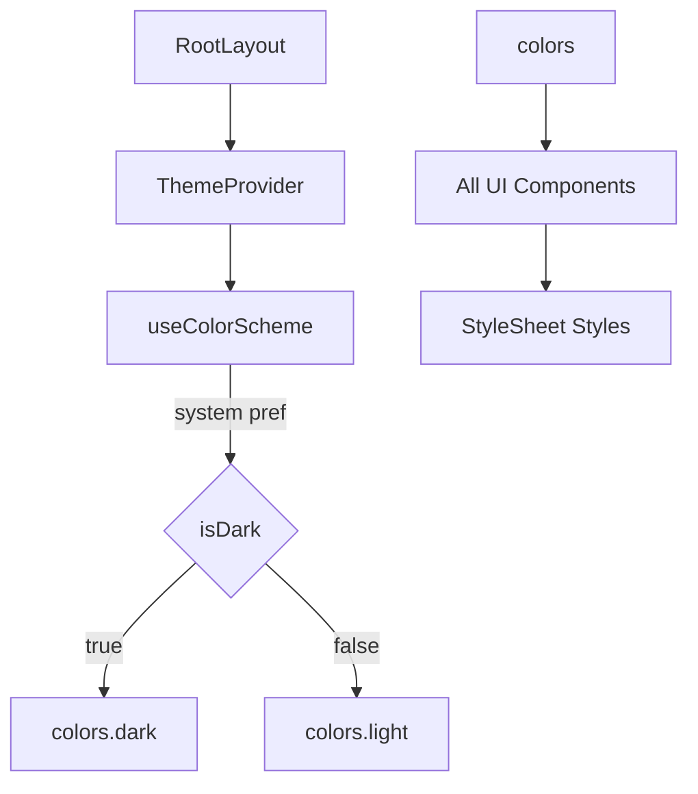

# Design Document: Mobile Design Alignment with Web

## Overview

Refactor the mobile app's design system and UI components to match the production web app. The approach is a focused theme-and-component overhaul: update the theme token files to mirror the web's CSS custom properties, rebuild each UI component to use those tokens, add dark mode support, and adjust screen layouts. No routing, business logic, or data layer changes are required.

### Key Technologies

- **Mobile Framework**: React Native 0.81, Expo 54, Expo Router 6
- **Icons**: Lucide React Native 1.17
- **State**: Zustand, React Query (via custom hooks)
- **Backend**: Supabase (shared config from `packages/shared`)
- **Fonts**: `@expo-google-fonts/plus-jakarta-sans` (new), removing `@expo-google-fonts/space-grotesk` and `@expo-google-fonts/manrope`

### Design Principles

1. **Visual Parity**: Mobile components should be visually indistinguishable from their web counterparts, adapted for touch.
2. **Token-Driven**: Every color, spacing, radius, and font choice comes from theme tokens — no hardcoded values.
3. **Dark-First Architecture**: Dark mode is a first-class concern baked into the token structure, not an afterthought.
4. **Minimal Bloat**: Only add new dependencies when necessary; leverage existing patterns (StyleSheet.create, theme exports).
5. **Progressive Enhancement**: Update tokens first, then components, then screen layouts — each layer relies on the previous.

## Architecture

### Theme Token Architecture

```
ThemeContext (isDark state)
    |
    v
colors[isDark ? 'dark' : 'light']  -->  UI Components (via StyleSheet)
typography  -->  UI Components
spacing     -->  UI Components
rounded     -->  UI Components
```

The current flat `colors` object becomes a nested structure:

```typescript
// Current (flat)
export const colors = {
  brand: { 50: "#f0f7ff", ... },
  ink: "#0f172a",
  body: "#334155",
  // ...
};

// New (nested light/dark)
export const colors = {
  light: {
    primary: "#0d9488",
    "primary-hover": "#0f766e",
    "primary-light": "#ccfbf1",
    secondary: "#1e3a5f",
    "secondary-soft": "#2d5282",
    bg: "#f8fafb",
    surface: "#ffffff",
    "surface-alt": "#f1f5f9",
    "text-primary": "#1a202c",
    "text-secondary": "#4a5568",
    "text-muted": "#718096",
    success: "#059669",
    "success-bg": "#ecfdf5",
    "success-border": "#a7f3d0",
    warning: "#d97706",
    "warning-bg": "#fffbeb",
    "warning-border": "#fde68a",
    error: "#dc2626",
    "error-bg": "#fef2f2",
    "error-border": "#fecaca",
    info: "#0d9488",
    "info-bg": "#ccfbf1",
    "info-border": "#99f6e4",
    border: "#e2e8f0",
    "border-focus": "#0d9488",
    "nav-bg": "#ffffff",
    "nav-active": "#0d9488",
    "nav-inactive": "#94a3b8",
    "nav-border": "#e2e8f0",
    "on-primary": "#ffffff",
  },
  dark: {
    primary: "#14b8a6",
    "primary-hover": "#0d9488",
    "primary-light": "#134e4a",
    secondary: "#93c5fd",
    "secondary-soft": "#bfdbfe",
    bg: "#0f1f2e",
    surface: "#162636",
    "surface-alt": "#1e3448",
    "text-primary": "#f1f5f9",
    "text-secondary": "#cbd5e1",
    "text-muted": "#94a3b8",
    success: "#34d399",
    "success-bg": "#064e3b",
    "success-border": "#047857",
    warning: "#fbbf24",
    "warning-bg": "#78350f",
    "warning-border": "#b45309",
    error: "#f87171",
    "error-bg": "#7f1d1d",
    "error-border": "#b91c1c",
    info: "#14b8a6",
    "info-bg": "#134e4a",
    "info-border": "#0f766e",
    border: "#2d4a63",
    "border-focus": "#14b8a6",
    "nav-bg": "#162636",
    "nav-active": "#14b8a6",
    "nav-inactive": "#64748b",
    "nav-border": "#2d4a63",
    "on-primary": "#ffffff",
  },
};
```

### Component Architecture

Each component:
1. Imports theme tokens from `../../theme`
2. Uses `useTheme()` hook to get current colors (light/dark)
3. Builds `StyleSheet.create()` styles using the current color values
4. Web's Tailwind utility classes are converted to React Native `StyleSheet` properties

### Dark Mode Architecture



## Components and Interfaces

### Theme

#### `src/theme/colors.ts`
- Exports `{ colors: { light: ColorTokens, dark: ColorTokens } }`
- `ColorTokens` matches web's CSS custom properties (kebab-cased keys)

#### `src/theme/typography.ts`
- Changes `fontFamily` to Plus Jakarta Sans weights
- Removes Space Grotesk and Manrope references

#### `src/theme/spacing.ts`
- Adds scale matching web's Tailwind spacing: `0, 0.5, 1, 1.5, 2, 2.5, 3, 3.5, 4, 5, 6, 7, 8, 9, 10, 11, 12, 14, 16, 20, 24, 28, 32, 36, 40, 44, 48, 52, 56, 60, 64, 72, 80, 96`
- Keeps semantic aliases (xxs, xs, sm, md, lg, xl, xxl)

#### `src/theme/rounded.ts`
- Updates values: sm=4 (rounded), md=14 (rounded-xl), lg=16 (rounded-2xl), pill=9999

#### `src/contexts/ThemeContext.tsx` (new)
- Provides `isDark` boolean and `colors` object (current mode)
- Uses `useColorScheme()` from react-native
- Wraps in `RootLayout`

### UI Components (redesigned)

#### `Button.tsx`
- **Variants**: `default`, `outline`, `ghost`, `destructive` (matching web)
- **Sizes**: `default` (h-11 / 44px), `sm` (h-9 / 36px), `lg` (h-12 / 48px)
- **Props**: `variant`, `size`, `onPress`, `disabled`, `loading`, `children`, `style`
- **Styles**: rounded-xl (~14px), border/background per variant, text-sm font-medium

#### `Card.tsx`
- **Props**: `children`, `style`
- **No variants** (was default/signature/cream — now just one style)
- **Styles**: rounded-2xl (16px), 1px border-border, bg-surface, p-4

#### `Badge.tsx`
- **Colors**: `neutral` (slate), `success` (emerald), `warning` (amber), `error` (rose), `info` (teal)
- **Styles**: rounded-full, px-2.5 py-0.5, text-xs font-medium
- Color values match web's badge patterns exactly

#### `Input.tsx`
- **Styles**: rounded-xl (~14px), h-11 (44px), border-border, bg-surface, px-3
- **Focus**: ring-2 equivalent with border-focus color
- **Label**: text-sm font-medium, text-text-secondary
- **Error**: border-error, error-text below

#### `Chip.tsx`
- **Selected**: border-primary-light, bg-primary-light, text-primary
- **Unselected**: border-border, bg-surface, text-text-secondary
- **Styles**: rounded-full, py-0.5 px-3

#### `Skeleton.tsx`
- **Props**: `width?`, `height?`, `style`
- **Styles**: rounded-xl, bg-surface-alt, animate-pulse

#### `ProfileAvatar.tsx` (new, matching web's `profile-avatar.tsx`)
- **Props**: `src?`, `name?`, `size` ('sm' | 'md' | 'lg')
- **Sizes**: sm: 44px, md: 64px, lg: 80px
- **Styles**: rounded-full, border-slate-200, bg-slate-100, flex centered
- Shows image, initials, or User icon fallback

#### `StarDisplay.tsx` (redesigned)
- **Props**: `rating` (number), `size` ('sm' | 'md')
- Uses Unicode filled (★) / empty (☆) stars in amber (#fbbf24)
- Match web's star rendering exactly

#### `StarRating.tsx` (redesigned)
- **Props**: `value`, `onChange`
- Uses Unicode stars in amber (#fbbf24), interactive
- Match web's star rating exactly

#### `EmptyState.tsx` (new, matching web's `empty-state.tsx`)
- **Props**: `icon` (ReactNode), `title`, `description?`, `action?`
- **Layout**: Centered column, rounded-2xl border border-border bg-surface, px-6 py-10
- **Icon**: in rounded-full bg-surface-alt container
- **Title**: text-base font-semibold text-text-primary
- **Description**: text-sm text-text-secondary

### Navigation

#### `TabBar.tsx` / Tab Layouts (redesigned)
- **Height**: 64px (h-16)
- **Border**: top 1px nav-border
- **Active icon**: nav-active color, filled variant
- **Inactive icon**: nav-inactive color
- **Label**: 10px, centered, nav-active/nav-inactive color
- **Badge**: absolute positioned, bg-error, text-on-primary, rounded-full

### Screen Layouts

#### `ScreenWrapper.tsx`
- **Background**: `bg` color (not white canvas)
- **SafeArea**: standard
- **Scroll**: optional

#### Landing Screen (`app/index.tsx`)
- Background: bg color
- App name: teal primary color, text-3xl, font-semibold
- Tagline: text-text-secondary
- Buttons: full-width, stacked

#### Login Screen (`app/(auth)/login.tsx`)
- Background: bg
- Title: text-text-primary, text-3xl font-semibold
- Subtitle: text-text-secondary
- Inputs: per Input spec above
- Button: full-width teal

#### Family Dashboard (`app/(family)/index.tsx`)
- Background: bg
- Cards: per Card spec
- Sections: consistent gap and typography

#### Nurse Dashboard (`app/(nurse)/index.tsx`)
- Background: bg
- Verification banner: updated status colors
- Booking cards: per Card spec

## Correctness Properties

### Property 1: Token Completeness

For every CSS custom property defined in the web's `tokens.css`, there SHALL be a corresponding key in both `colors.light` and `colors.dark`.

**Validates: Requirements 1.1–1.10**

### Property 2: Component Style Coverage

For every UI component (Button, Card, Badge, Input, Chip, Skeleton, Avatar, TabBar), every visual variant on the web SHALL have a corresponding visual variant on mobile with identical colors, border radii, and typography.

**Validates: Requirements 4.1–4.9, 5.1–5.8**

### Property 3: Dark Mode Toggle

For every component and screen, switching the theme context from light to dark SHALL produce the exact dark color set defined in the web's `html.dark` tokens.

**Validates: Requirements 6.1–6.6**

### Property 4: Font Consistency

Every text element in the mobile app SHALL use Plus Jakarta Sans as its font family, matching the web's `--font-body`.

**Validates: Requirements 2.1–2.4**

### Property 5: No Regression

After all visual changes, all existing navigation flows, data fetching, form submissions, and auth flows SHALL continue to function exactly as before.

**Validates: Preservation Requirements 1–4**

## Error Handling

| Scenario | Response | User Feedback |
|----------|----------|---------------|
| Missing color token | Fallback to hardcoded safe value (#000 or #fff) | Dev warning in console |
| Font not loaded | System sans-serif fallback | None (handled by Expo font loading) |
| Dark mode not supported on device | Stay in light mode | None |
| Component used without ThemeProvider | Throw clear error | Dev warning in console |

## Testing Strategy

### Unit Tests
- Verify each color token key exists in both light and dark modes
- Verify Button renders correct colors per variant
- Verify Badge renders correct colors per status type
- Verify Chip renders selected/unselected styles
- Verify StarDisplay renders correct number of filled stars

### Visual / Snapshot Tests
- Capture snapshots of all UI components in light and dark modes
- Capture snapshots of key screens (landing, login, family dashboard, nurse dashboard)

### Integration Tests
- Verify theme switching works across component boundaries
- Verify tab bar highlights correct tab based on route

### Accessibility Tests
- Verify all touchable components have `accessibilityRole` and `accessibilityLabel`
- Verify color contrast ratios meet WCAG AA in both light and dark modes

### Property-Based Testing Applicability

**Assessment**: NOT APPLICABLE

**Rationale**: This is a visual alignment task focused on static design tokens and component styles. There are no algorithmic invariants, state machines, or complex input/output transformations to test. Visual correctness is best verified through snapshot testing and manual visual inspection.
