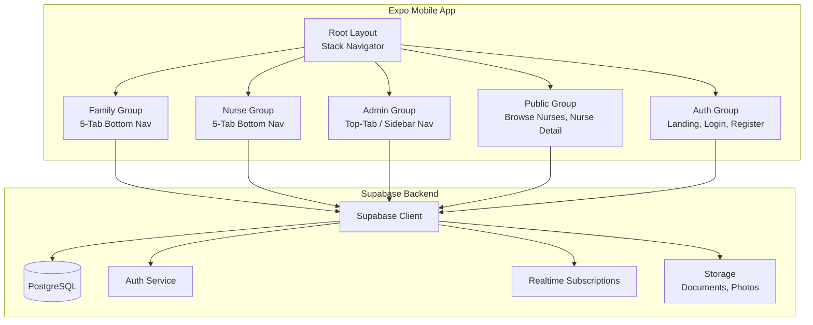
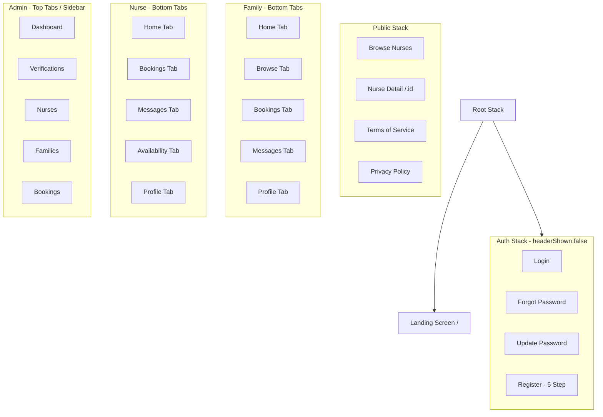

# Design Document: Mobile Version of HanapKalinga Web App

## Overview

The mobile app adapts the Airtable-inspired design system from `apps/mobile/designs/DESIGN-airtable.md` — editorial section rhythm, signature surface cards, near-black primary CTA, generous whitespace, and hierarchical border radii — but replaces Airtable's coral/forest/peach signature palette with the web app's blue brand spectrum (`brand-50` through `brand-900`). The result is a mobile UI that feels like "Airtable's editorial calm" but branded in HanapKalinga's signature blue.

**Architecture**: expo-router file-based routing groups routes by role (auth, public, family, nurse, admin) with shared layouts. All data flows through the existing Supabase backend — no new server code. A design token system in a single `theme.ts` file unifies colors, typography, spacing, and component styles, consumed by a set of reusable React Native primitives.

**Key constraint**: The design must feel native-mobile while preserving the web's visual brand identity. Bottom tab navigation replaces the web's sidebar/header; full-screen modal sheets replace dropdowns; swipe gestures and pull-to-refresh are first-class patterns.

### Key Technologies

- **Framework**: Expo ~54.0.0, React Native 0.81.5
- **Routing**: expo-router ~6.0.24 (file-based)
- **Navigation**: @react-navigation/native ^7.0.0 (bottom tabs, stack)
- **Backend**: Supabase (existing shared client at `lib/supabase.ts`)
- **Auth Persistence**: expo-secure-store ~15.0.8
- **Shared Package**: @hanapkalinga/shared (types, constants, validations)
- **Fonts**: Space Grotesk (display), Manrope (body) — loaded via `expo-font` or `@expo-google-fonts`
- **Icons**: Lucide React Native (matching web's icon library)
- **Date Picker**: `@react-native-community/datetimepicker` (native date selection)
- **Image Picker**: `expo-image-picker` (document/photo uploads)
- **Document Viewer**: `expo-file-system` + `expo-sharing` or WebView for PDF preview
- **Maps**: `react-native-maps` or static map image via URL scheme

### Design Principles

1. **Editorial Calm, Brand Voltage**: White canvas is the default surface (Airtable principle). Brand voltage comes from signature blue cards (`brand-600`, `brand-800`, `brand-900`) that punctuate the scroll rhythm — not from gradients or decorative effects. This matches the web's radial gradient subtly as a secondary atmospheric layer.

2. **One Primary Action Per Viewport**: The primary CTA (solid brand-600 pill) appears exactly once per screen. Secondary actions use the outline variant (white with brand-200 border). This conserves the brand's "confident and final" action language.

3. **Mobile-Native Navigation**: Bottom tab bars replace sidebar navigation. Stack navigation handles auth flows and detail drill-downs. Pull-to-refresh on all list screens. Gesture-based back navigation on iOS.

4. **Reuse Shared Backend Logic**: Mobile uses the same Supabase client, shared types, constants, and validation schemas from `@hanapkalinga/shared`. No mobile-specific backend code.

5. **Section Rhythm on Mobile**: The web's section rhythm (white → signature card → white → cream → dark → white) is preserved but adapted to vertical scrolling. Signature cards are full-width with reduced padding on mobile (48px → 24px internal).

6. **Touch-First Targets**: All interactive elements are ≥44×44pt (WCAG AAA for touch). Buttons have 16px vertical padding minimum. Inputs are 48px tall.

## Architecture

### High-Level Architecture



### Navigation Architecture



### Route Map

```
app/
  _layout.tsx                           Root Stack (StatusBar, no header)
  index.tsx                             Landing screen (auth check → redirect)

  (auth)/
    _layout.tsx                         Auth stack
    login.tsx
    forgot-password.tsx
    update-password.tsx
    register/
      index.tsx                         Step 1: email
      verify-otp.tsx                    Step 2: OTP code
      choose-role.tsx                   Step 3: family/nurse
      profile.tsx                       Step 4: profile form
      set-password.tsx                  Step 5: password

  (public)/
    _layout.tsx                         Public stack
    nurses/
      index.tsx                         Browse nurses list
      [id].tsx                          Nurse detail

  (family)/
    _layout.tsx                         Family bottom tabs
    index.tsx                           Dashboard home
    profile.tsx
    bookings/
      index.tsx                         Bookings list
      new.tsx                           New booking request
      [id].tsx                          Booking detail + message thread

  (nurse)/
    _layout.tsx                         Nurse bottom tabs
    index.tsx                           Dashboard home
    profile.tsx
    bookings/
      index.tsx                         Booking requests list
      [id].tsx                          Booking detail + message thread
    availability.tsx                    Weekly calendar
    messages.tsx                        Messages inbox

  (admin)/
    _layout.tsx                         Admin layout
    index.tsx                           Dashboard
    verifications/
      index.tsx                         Verification queue
      [id].tsx                          Verification review
    nurses.tsx                          All nurses list
    families.tsx                        All families list
    bookings/
      index.tsx                         All bookings list
      [id].tsx                          Booking detail
```

## Components and Interfaces

### Design Token System

A single `src/theme.ts` file defines all tokens, consumed by every component:

```typescript
// Adapted from DESIGN-airtable.md with web blue palette
export const colors = {
  brand: {
    50: "#f0f7ff",    // surface-soft equivalent
    100: "#dcecff",   // signature-mint
    200: "#b8d9ff",   // signature-peach, border light
    300: "#85beff",   // info-border
    400: "#4a98ff",   // accent
    500: "#1f6fff",   // link, info
    600: "#1455e0",   // primary, signature-coral (replaces #aa2d00)
    700: "#113fb3",   // primary-active (pressed)
    800: "#0f2f85",   // signature-forest (replaces #0a2e0e)
    900: "#0d2466",   // surface-dark (replaces #181d26)
  },
  ink:       "#0f172a",  // slate-900 (replaces #181d26)
  body:      "#334155",  // slate-700
  muted:     "#64748b",  // slate-500
  hairline:  "#e2e8f0",  // slate-200
  canvas:    "#ffffff",
  surface: {
    soft:   "#f0f7ff",  // brand-50
    strong: "#f1f5f9",  // slate-100
    dark:   "#0d2466",  // brand-900
  },
  signature: {
    cream:  "#f0f7ff",  // brand-50 (light blue tint)
    yellow: "#fde68a",  // amber-200 (warm accent)
    mustard:"#fbbf24",  // amber-400
  },
  semantic: {
    link:    "#1f6fff", // brand-500
    info:    "#1f6fff",
    success: "#059669",
    error:   "#dc2626",
  },
} as const;

export const typography = {
  fontFamily: {
    display: "SpaceGrotesk_700Bold",     // Space Grotesk
    body:    "Manrope_400Regular",       // Manrope
    bodyMedium: "Manrope_500Medium",
    bodySemiBold: "Manrope_600SemiBold",
  },
  // Mobile-adapted scale (reduced from desktop by ~4-6px)
  size: {
    displayXl: 32,   // 48→32
    displayLg: 28,   // 40→28
    displayMd: 24,   // 32→24
    titleLg:   20,   // 24→20
    titleMd:   18,   // 20→18
    titleSm:   16,   // 18→16
    labelMd:   15,   // 16→15
    button:    15,   // 16→15
    body:      14,
    caption:   13,
    legal:     12,
  },
  lineHeight: {
    tight:  1.1,
    normal: 1.25,
    relaxed: 1.4,
  },
} as const;

export const rounded = {
  xs:    2,     // legal buttons
  sm:    6,     // inputs
  md:    10,    // cards
  lg:    12,    // primary CTA, signature cards
  pill:  9999,  // pricing (reserved for future)
  full:  9999,  // circular
} as const;

export const spacing = {
  xxs:    4,
  xs:     8,
  sm:     12,
  md:     16,
  lg:     24,
  xl:     32,
  xxl:    48,
  section: 64,  // reduced from 96 for mobile
} as const;
```

### Reusable UI Primitives

All primitives in `src/components/ui/`, following the same naming as web's shadcn/ui:

| Component | File | Purpose |
|-----------|------|---------|
| `Button` | `ui/button.tsx` | Variants: `primary` (brand-600 solid), `secondary` (white outline, brand-200 border), `ghost` (transparent), `link` (brand-500 text). Border radius `rounded.lg` for primary/secondary, `rounded.xs` for legal. Props mimic Airtable's `button-primary` / `button-secondary` specs. |
| `Input` | `ui/input.tsx` | Height 48pt, `rounded.sm`, hairline border. Focus: brand-300 border. Matches Airtable's `text-input` spec. |
| `Card` | `ui/card.tsx` | Variants: `default` (white bg, no shadow), `signature` (brand color bg, white text), `cream` (brand-50 bg). Border radius `rounded.md` or `rounded.lg`. Matches Airtable's card hierarchy. |
| `Badge` | `ui/badge.tsx` | Small status/tag labels. Colored by semantic meaning (success=emerald, pending=amber, etc.) |
| `Skeleton` | `ui/skeleton.tsx` | Loading placeholder with pulse animation |
| `Separator` | `ui/separator.tsx` | Hairline divider (`colors.hairline`) |
| `IconButton` | `ui/icon-button.tsx` | 44×44pt circular button (matching Airtable's `button-icon-circular` but enlarged to 44pt for WCAG) |
| `TextLink` | `ui/text-link.tsx` | Inline link in `colors.semantic.link` |
| `Chip` | `ui/chip.tsx` | Multi-select chip for skills/specializations. Selected: brand-600 bg, white text. Unselected: canvas bg, brand-200 border. |

### Domain-Specific Components

| Component | File | Purpose |
|-----------|------|---------|
| `NurseCard` | `components/nurse-card.tsx` | Card showing nurse name, city, specializations tags, daily rate, availability badge, provider type badge. Tappable → navigates to nurse detail. |
| `NurseFilters` | `components/nurse-filters.tsx` | Bottom sheet with filter controls: city picker, specialization multi-select, rate range, availability toggle |
| `BookingCard` | `components/booking-card.tsx` | Booking list item: date, shift label, status badge, unread count badge. |
| `BookingDetailCard` | `components/booking-detail-card.tsx` | Parses structured booking `notes` JSON into readable sections (patient condition, shift, skills, budget, additional notes) |
| `BookingForm` | `components/booking-form.tsx` | Date picker + condition selector + shift selector + skills chips + budget dropdown + notes textarea |
| `BookingReviewForm` | `components/booking-review-form.tsx` | StarRating + comment textarea + submit button |
| `MessageThread` | `components/message-thread.tsx` | Real-time chat: message list + input bar. Supports readOnly mode for admin. |
| `MessagesInbox` | `components/messages-inbox.tsx` | Conversations grouped by booking: other party name, last message preview, timestamp, unread badge |
| `AvailabilityCalendar` | `components/availability-calendar.tsx` | Week view with Previous/Next. 7 columns × 3 shifts (morning/afternoon/evening). Toggle open/closed per cell. |
| `VerificationStatusBadge` | `components/verification-status-badge.tsx` | Colored badge for verification state (pending/under_review/verified/rejected/resubmission) |
| `VerificationStatusBanner` | `components/verification-status-banner.tsx` | Full-width banner on nurse dashboard showing current verification status with actionable message |
| `NotificationsPanel` | `components/notifications-panel.tsx` | List of notifications with read/unread styling, mark-as-read gesture, Mark All Read button |
| `DocumentViewer` | `components/document-viewer.tsx` | WebView-based PDF/image viewer for PRC/TESDA/NBI documents |
| `DocumentUploader` | `components/document-uploader.tsx` | expo-image-picker integration with file type/size validation (max 5MB) |
| `StarRating` | `components/star-rating.tsx` | Touchable star row (1-5) for reviews |
| `RegionCitySelects` | `components/region-city-selects.tsx` | Cascading pickers: region → city (Philippine locations) |
| `NursesWelcomeBanner` | `components/nurses-welcome-banner.tsx` | Hero banner for Browse Nurses page with brand gradient background |
| `FamilyWelcomeBanner` | `components/family-welcome-banner.tsx` | First-visit banner on family dashboard |
| `EmptyState` | `components/empty-state.tsx` | Icon + title + subtitle + optional CTA for empty lists |
| `ErrorState` | `components/error-state.tsx` | Error icon + message + retry button |
| `LoadingState` | `components/loading-state.tsx` | Centered spinner/skeleton |

### Screen-Level Compositions

| Screen | Route | Components Used |
|--------|-------|-----------------|
| Landing | `index.tsx` | Button (primary + secondary), TextLink ("Log in"), displayLg heading, body text |
| Login | `(auth)/login.tsx` | Input (email, password), Button (primary), TextLink (forgot, register) |
| Register Step 1-5 | `(auth)/register/*` | Input, Button, Chip (role selection), Form sections, DocumentUploader |
| Browse Nurses | `(public)/nurses/index.tsx` | NurseCard list (FlatList), NurseFilters (bottom sheet), NursesWelcomeBanner, EmptyState, pull-to-refresh |
| Nurse Detail | `(public)/nurses/[id].tsx` | ScrollView: avatar + name section, Badge (availability), Chip (specializations), body text (bio), Card (rate cards), AvailabilityCalendar (7-day preview), Review list, Button (primary: "Request Booking") |
| Family Dashboard Home | `(family)/index.tsx` | FamilyWelcomeBanner, Card (promo "Find a nurse"), BookingCard list (3 max), Button ("Request booking") |
| Family New Booking | `(family)/bookings/new.tsx` | BookingForm (date, condition, shift, skills chips, budget, notes), Button (primary: "Submit Request") |
| Family Booking Detail | `(family)/bookings/[id].tsx` | Booking info section, BookingDetailCard, BookingReviewForm (if eligible), MessageThread |
| Family Messages | `(family)/messages/[bookingId].tsx` | MessageThread |
| Nurse Dashboard Home | `(nurse)/index.tsx` | VerificationStatusBanner, NotificationsPanel, BookingCard list (3 max), Button row ("Edit profile", "Set availability") |
| Nurse Availability | `(nurse)/availability.tsx` | Week navigation (Previous/Next), AvailabilityCalendar, Button (primary: "Save") |
| Nurse Booking Detail | `(nurse)/bookings/[id].tsx` | Booking info, Button row (Accept/Decline for pending), BookingDetailCard, MessageThread |
| Nurse Messages Inbox | `(nurse)/messages.tsx` | MessagesInbox |
| Admin Dashboard | `(admin)/index.tsx` | Metric cards (4), quick actions list, status legend |
| Admin Verification Queue | `(admin)/verifications/index.tsx` | Tabbed filter (SegmentedControl), applicant list, SearchBar |
| Admin Verification Review | `(admin)/verifications/[id].tsx` | Applicant info section, DocumentViewer, audit log list, action Button row (approve/reject/resubmit/mark under review), Input (rejection reason, review notes) |
| Admin Manage Nurses | `(admin)/nurses.tsx` | Nurse list with search, FilterBar, NurseCard |
| Admin Manage Families | `(admin)/families.tsx` | Family list with search |
| Admin Manage Bookings | `(admin)/bookings/index.tsx` | Booking list with filters, status badges |
| Admin Booking Detail | `(admin)/bookings/[id].tsx` | Booking info, status update Button, BookingDetailCard, MessageThread (readOnly) |

### Data Layer

**Supabase Client** (extends existing `lib/supabase.ts`):
- Uses `expo-secure-store` for auth token persistence (already implemented)
- Typed queries using generated Supabase types
- Realtime subscriptions for message channels (via Supabase Realtime)

**Data Fetching Pattern**:
- Each screen uses a custom hook (e.g., `useNurses(filters)`, `useBookings(role, userId)`, `useMessages(bookingId)`)
- Hooks return `{ data, loading, error, refetch }` — consumed by LoadingState / ErrorState / data render
- FlatList with `onEndReached` for pagination (nurses list, bookings list)
- `refreshControl` prop for pull-to-refresh on all list screens

**Realtime**:
- MessageThread subscribes to `realtime:public:messages` with filter `booking_id=eq.{id}`
- Notifications panel subscribes to `realtime:public:notifications` with filter `user_id=eq.{userId}`
- Unsubscribe on screen unmount

## Data Models

All data models are inherited from `@hanapkalinga/shared/types` — the mobile app does not define its own types. Key interfaces:

```typescript
// From shared/types.ts — used by mobile components
Profile, Nurse, Family, Booking, Availability, Message, Review
UserRole, VerificationStatus, BookingStatus, Shift, ProviderType
```

## Correctness Properties

### Property 1: Auth Gate

*For any* screen in `(family)/`, `(nurse)/`, or `(admin)/`, the system SHALL redirect unauthenticated users to the login screen.

**Validates: Requirements 1.1, 1.6**

### Property 2: Role Gate

*For any* screen in `(family)/`, THE authenticated user SHALL have role `"family"`. For `(nurse)/`, role `"nurse"`. For `(admin)/`, role `"admin"`. Violations SHALL redirect to the user's own dashboard.

**Validates: Requirements 3, 4, 5**

### Property 3: Consistent Data

*For any* query to the Supabase backend, the mobile app SHALL display the same data as the web app for the same query parameters, because both use the identical Supabase client and shared types.

**Validates: Requirements 1.7, 2.4, 6.4**

### Property 4: Message Ordering

*For any* message thread, messages SHALL be displayed in ascending chronological order. A new message sent by either party SHALL appear at the bottom of the thread within 2 seconds.

**Validates: Requirement 7.2**

### Property 5: Booking State Machine

*For any* booking, transitions SHALL follow: `pending → accepted | declined | cancelled` and `accepted → completed | cancelled`. The system SHALL NOT allow invalid transitions (e.g., `pending → completed`).

**Validates: Requirements 3.4, 4.5**

### Property 6: Touch Target Size

*For any* interactive element (button, link, input, chip, badge), the minimum tappable area SHALL be 44×44pt, excluding inline text links and non-interactive badges.

**Validates: Design Principle 6**

### Property 7: Verification State Persistence

*For any* nurse, changing their profile documents (PRC/TESDA/NBI) SHALL reset their `verification_status` to `"pending"`, requiring re-verification by an admin.

**Validates: Requirement 4.2**

## Error Handling

| Scenario | UI Response | User Feedback |
|----------|-------------|---------------|
| Network unavailable | ErrorState with retry button | "No internet connection. Tap to retry." |
| Supabase query fails | ErrorState on affected screen | "Something went wrong loading [data]. Please try again." |
| Auth token expired | Auto-redirect to login | Silent redirect (no toast) |
| Login wrong credentials | Inline form error | "Invalid email or password." |
| Registration OTP wrong | Inline form error | "Invalid verification code. Please try again." |
| File upload fails | Toast/banner on upload screen | "Failed to upload [file name]. Please try again." |
| File size exceeds limit | Inline validation | "File must be under 5MB." |
| Booking submission fails | Toast/banner | "Failed to submit booking request. Please try again." |
| Message send fails | Message shows error state with retry icon | "Failed to send. Tap to retry." |
| Empty data (no results) | EmptyState component | Contextual: "No nurses found matching your filters." / "No bookings yet." |
| Form validation errors | Inline field-level errors | Specific per-field messages from zod schema |

## Testing Strategy

### Unit Tests

- **Design tokens**: All color/spacing/typography tokens match the expected values from the merged design spec
- **Component rendering**: Each UI primitive renders correctly for each variant (button primary/secondary/ghost, card default/signature/cream, badge semantic colors)
- **Form validation**: Registration, login, booking, profile forms validate correctly per zod schemas
- **Helper functions**: Date formatting, shift labels, rate display, status label mapping

### Integration Tests

- **Navigation flows**: Auth flow (landing → register → OTP → profile → dashboard), booking flow (family books → nurse accepts → chat), verification flow (admin reviews → approves)
- **Supabase queries**: Each data-fetching hook returns correctly typed data matching the shared types
- **Realtime subscriptions**: Message thread updates in real-time when new message is inserted
- **File upload/download**: Document uploader stores file to Supabase Storage and retrieves signed URL

### End-to-End Tests

- **Full user journeys**: Sign up as family → browse nurses → view profile → request booking → chat with nurse → leave review
- **Admin verification flow**: Navigate verifications → review documents → approve → verify nurse appears as verified in browse
- **Cross-role consistency**: Nurse sets availability → family sees it on nurse profile → nurse dashboard shows updated state

### Accessibility Tests

- **Touch target audit**: Verify all interactive elements ≥44×44pt
- **Screen reader labels**: All icons, buttons, and interactive elements have accessible labels
- **Color contrast**: Text on signature cards (white on brand-600/800/900) meets WCAG AA contrast ratio
- **Focus indicators**: Keyboard-navigable elements show visible focus rings (Android TV / external keyboard)

### Property-Based Testing Applicability

**Assessment**: NOT APPLICABLE for most screens, APPLICABLE for the booking state machine.

**Rationale**: Mobile app screens are primarily UI compositions and data-fetching wrappers — property-based testing adds little value for rendering logic. The booking state machine (Property 5) is a good candidate for PBT: generate arbitrary sequences of status transitions and verify no invalid states are reachable. The message ordering property (Property 4) could also benefit from PBT (generate arbitrary message insertions and verify chronological output). For all other screens, traditional unit + integration testing is more practical and maintainable.
